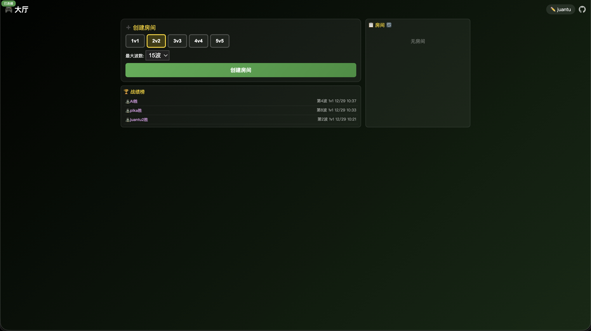

# PvZ 5v5 Multiplayer 🌻🧟

立即体验: https://pvz.xbarry.com/

植物大战僵尸多人对战版 - 支持 5v5 实时对战!

## 游戏截图





## 特性

- 🎮 **实时多人对战**: 1v1 到 5v5 植物 vs 僵尸
- 🌊 **波次系统**: 自动波次(每波=波数只僵尸) + 手动购买波次(800 脑子)
- 🤖 **智能 AI**: 自动补位机器人
- 🚜 **原版机制**: 每行配备一次性推土机(割草机)防线
- 🏳️ **投降功能**: 支持中途投降(对方获胜)
- 🔄 **断线续玩**: 支持断线重连，防止网络波动
- ⚡ **无缝加载**: 预加载遮罩，消除闪烁体验
- ⏸️ **暂停系统**: 无人时自动暂停
- 📊 **排行榜**: 显示玩家名字的游戏历史记录
- ⏱️ **卡牌冷却**: 像原版一样的充能系统
- 🏆 **胜利条件**: 最后一波消灭所有僵尸即可获胜

## 植物

| 植物     | 图标 | 价格 | 冷却 | 效果                |
| -------- | ---- | ---- | ---- | ------------------- |
| 向日葵   | 🌻   | 50   | 5s   | 产生阳光            |
| 豌豆射手 | 🌱   | 100  | 5s   | 发射豌豆            |
| 双发射手 | 🌿   | 200  | 5s   | 发射两颗豌豆        |
| 寒冰射手 | ❄️   | 175  | 5s   | 减速僵尸            |
| 火炬树桩 | 🔥   | 175  | 5s   | 豌豆变火球(2x 伤害) |
| 坚果墙   | 🌰   | 75   | 20s  | 高 HP 防御          |
| 高坚果   | 🥜   | 125  | 20s  | 阻挡跳跃僵尸        |
| 食人花   | 🐊   | 150  | 5s   | 一口吃掉僵尸        |
| 土豆雷   | 🥔   | 25   | 20s  | 炸死靠近的僵尸      |
| 樱桃炸弹 | 🍒   | 175  | 35s  | 范围爆炸            |

## 僵尸

| 僵尸       | 图标 | 价格 | 冷却 | 特点                       |
| ---------- | ---- | ---- | ---- | -------------------------- |
| 普通僵尸   | 🧟   | 50   | 2s   | 基础单位                   |
| 路障僵尸   | 🧟‍♂️   | 100  | 3s   | 较高 HP                    |
| 铁桶僵尸   | 🪣   | 175  | 5s   | 高 HP                      |
| 撑杆跳僵尸 | 🏃   | 125  | 4s   | 跳过第一个植物(高坚果除外) |
| 旗帜僵尸   | 🎌   | 75   | 2.5s | 速度快                     |
| 报纸僵尸   | 📰   | 80   | 3s   | 中等 HP                    |
| 橄榄球僵尸 | 🏈   | 275  | 10s  | 超高 HP 和伤害             |
| 脑子僵尸   | 🧠   | 50   | 3s   | 产生脑子资源(后期更快)     |

## 波次系统

- 第 N 波 = N 只僵尸 (第 1 波=1 只, 第 10 波=10 只, 最多 15 只)
- 自动波次每 45 秒刷新
- 僵尸玩家可花费 800 脑子购买额外波次
- 脑子僵尸产脑速度随波数加快 (第 1 波 6 秒, 第 15 波 2 秒)

## 安装

```bash
npm install
npm start
```

访问 http://localhost:3000

## 技术栈

- Node.js + Express
- Socket.IO (实时通信)
- 原生 HTML/CSS/JS

## License

MIT
